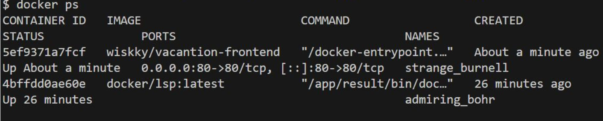
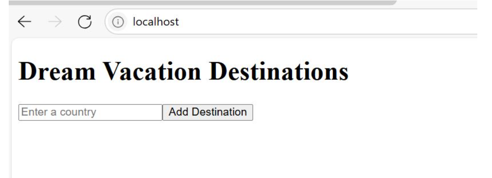
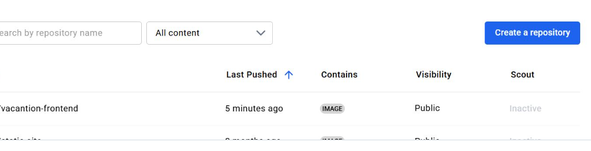
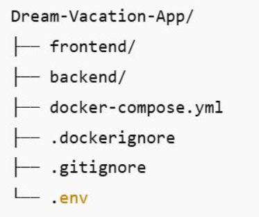
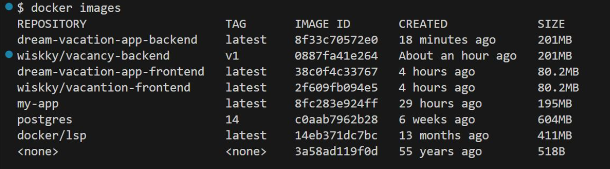
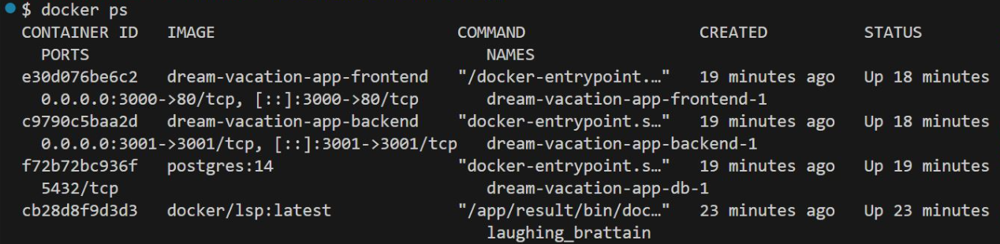
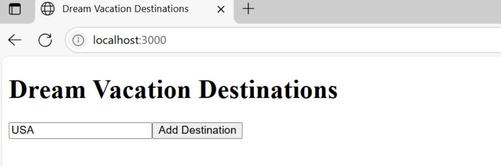

# 🌴 Dream Vacation App

**Dream Vacation App** is a full-stack web application that allows users to discover and explore vacation destinations worldwide. Built with modern web technologies and fully containerized, it offers a scalable and flexible solution for travel inspiration platforms.

---

## 🧰 Tech Stack

| Layer             | Technology             |
|------------------|------------------------|
| Frontend         | React, Axios           |
| Backend          | Node.js (Express)      |
| Database         | PostgreSQL             |
| Containerization | Docker, Docker Compose |

---

## ✨ Features

- Browse curated vacation spots with rich visuals  
- API-driven architecture for dynamic content delivery  
- Persistent data storage using PostgreSQL  
- Containerized deployment for seamless scalability  
- Quick local development with Docker Compose  

---

## 🛠️ Getting Started

### 📦 Prerequisites

Before you begin, ensure you have the following installed:

- [Node.js](https://nodejs.org/)  
- [Docker](https://www.docker.com/)  
- [Docker Compose](https://docs.docker.com/compose/)  

Install required frontend packages:

```bash
 npm install react react-dom react-scripts axios
```

Use docker-compose command to buuild and run both the frontend and backend with the databbase together.

**Note:** This project uses postgress database 

**To build frontend, kindly use**  
```bash
# docker build . -t vacantion-frontend:latest
````

You must run this command where the Dockerfile is located

**To push this to docker hub, we need to tag our image**  
```bash
# docker build . -t me/vacantion-frontend:latest
```

Please check your image by running     
```bash
# docker images
```  

To containarize the docker image, run 
```bash
# docker run -d -p 80:80 me/vacancy-frontend
```

Then run 
```bash
# docker ps
```


  

On your broswer, type http:localhost


To push your image into docker hub, Then run 

```bash
# docker push wiskky/vacantion-frontend:latest
``` 


Login into your docker hhub accont and check 


**NOTE** For backend ollow the same step aove to run docker build command and push.

# Using docker compose to containerize the application


Use the below command, to run docker compose,
```bash
 # docker-compose up --build
```

After  running, then check the image and the container
```bash
  # docker images
```

  

Note that two images are added dream-vacantion-backend and dream-vacantion-frontend.

Also, check if your container is running  
```bash
 # docker ps
````


  

Now go to your browser and check yyour application if it is running  

`http://localhost:3000`  

